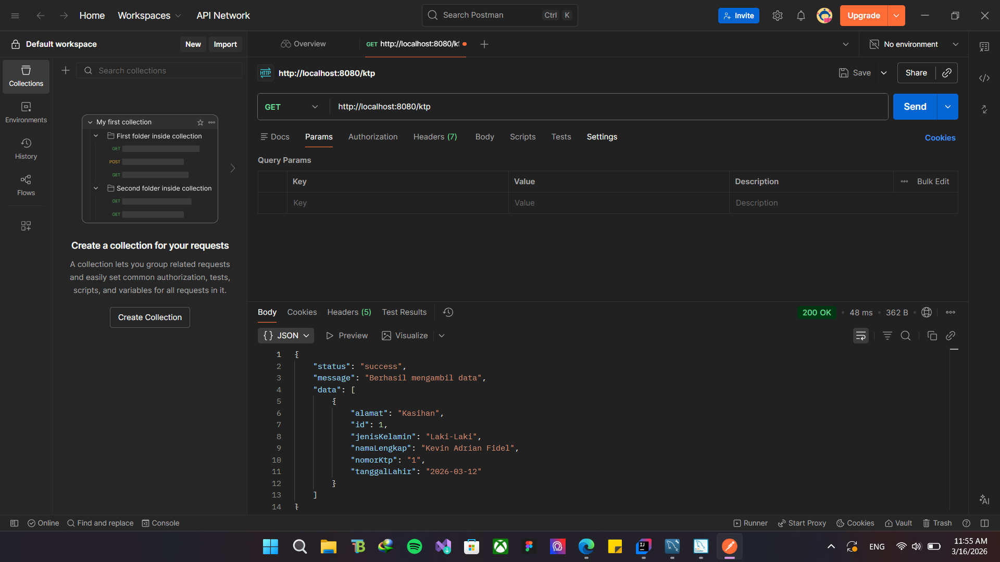
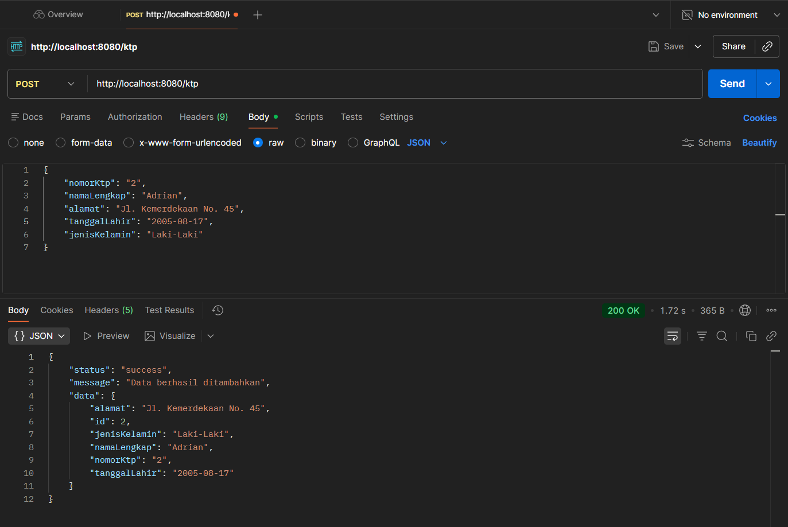
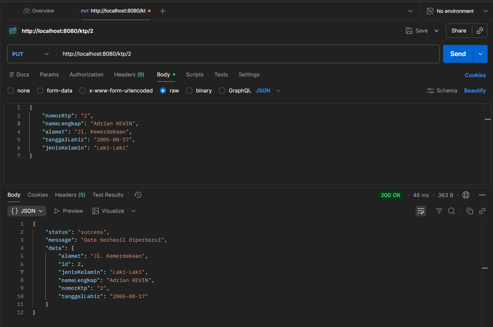
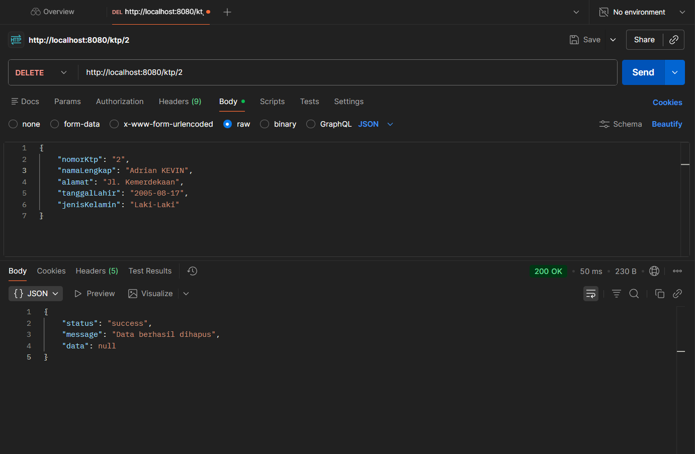
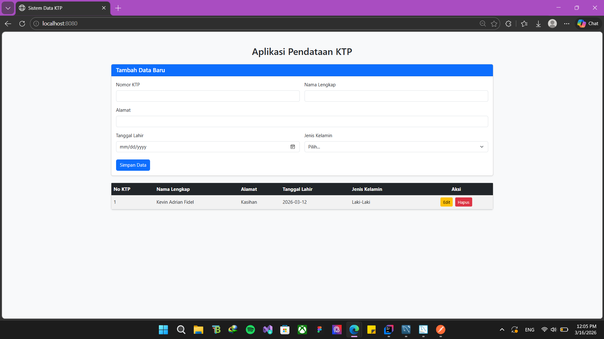
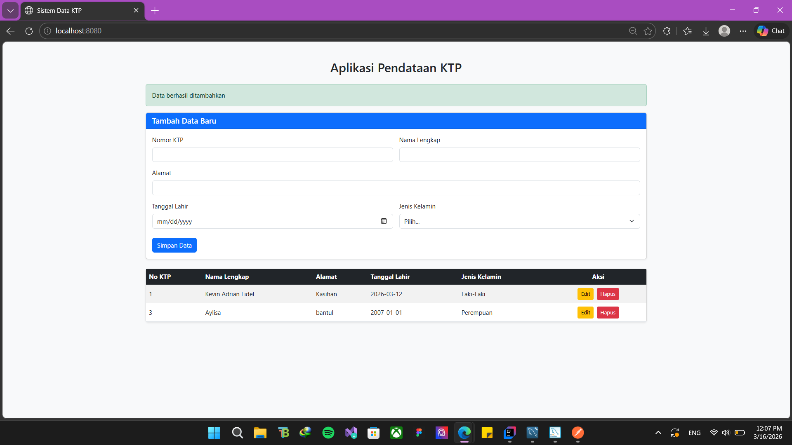
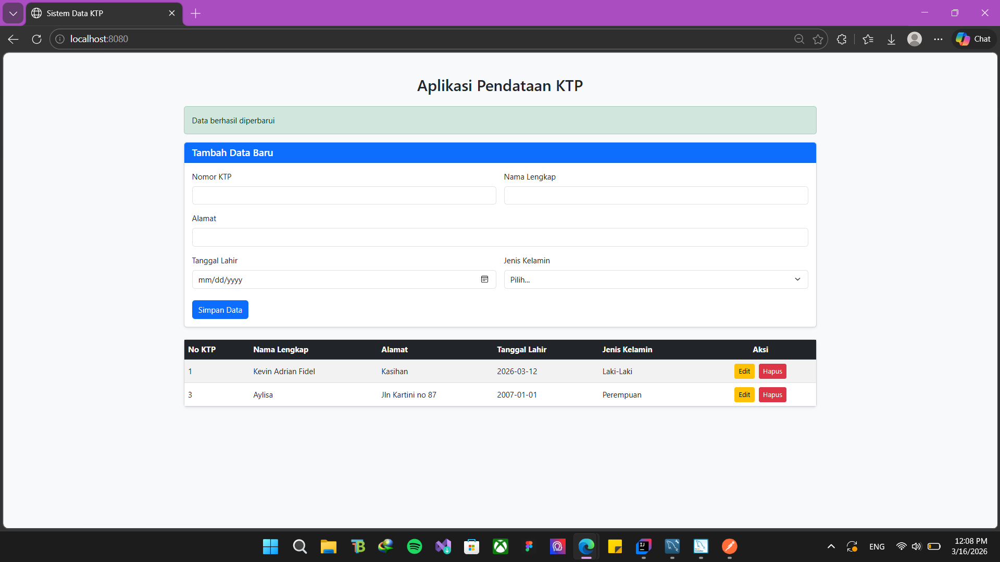
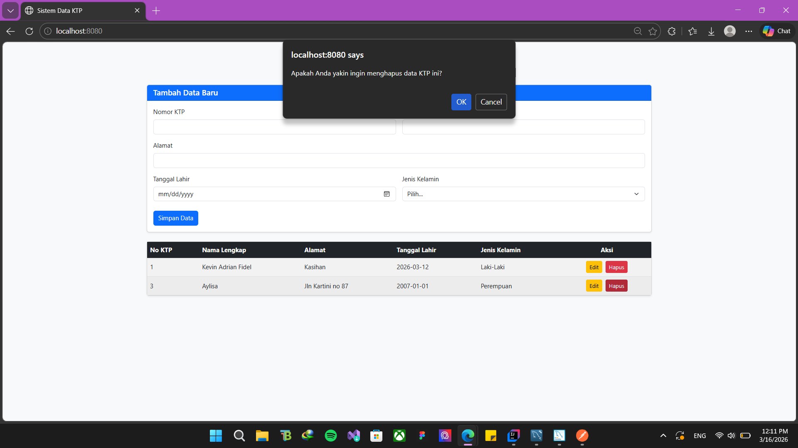
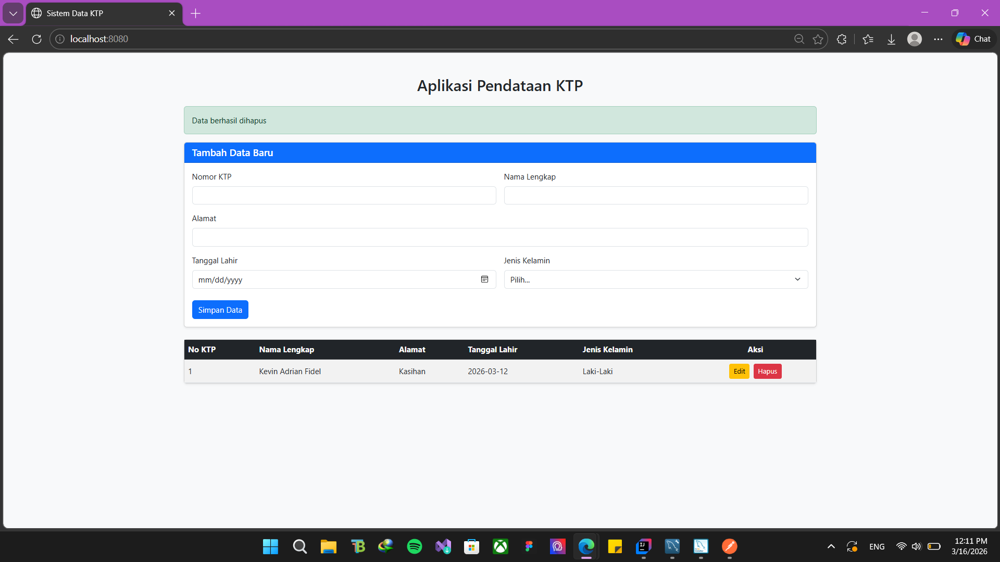
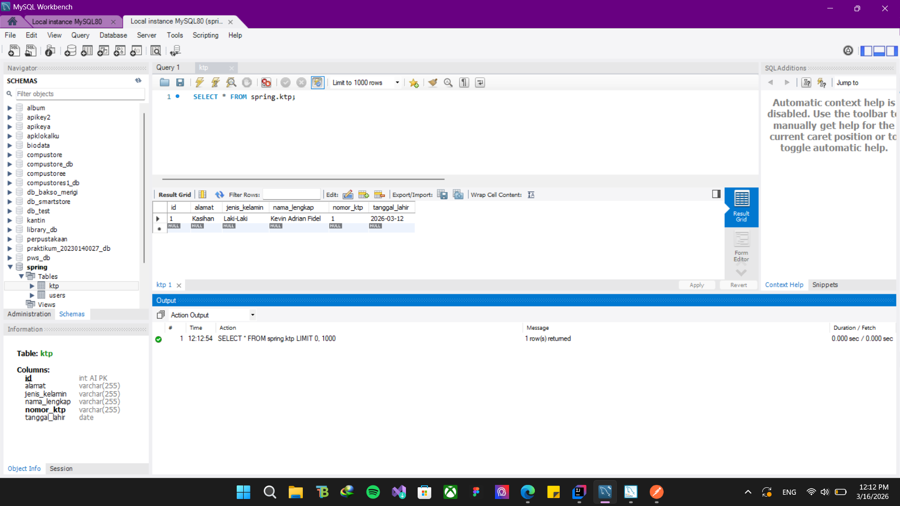

POSTMAN

- GET

- POST

- PUT

-DELETE

-TAMPILAN WEB

- TAMPILAN WEB JIKA BERHASIL DI TAMBAHKAN

- TAMPILAN WEB JIKA BERHASIL DI PERBARUI

- TAMPILAN WEB JIKA INGIN / BERHASIL DIHAPUS

-DATABASE

